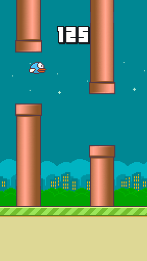

NOTE: This implementation borrows and modifies a PyGame Version of flappy bird found at https://github.com/sourabhv/FlapPyBird, by Sourabh Verma (sourabhv)

                            Flappy Bird with neural network and use of Genetic Algorithms
                                                   -Group Members-
                                                   Keiland Cooper
                                                   Kirk Harlow
                                                   Christopher East

Project description: Design an AI-based project for IU's CSCI-B 351 - Intro to Artificial Intelligence. The team designed
                     a flappy bird clone that uses two technologies: Neural Networks and Genetic Algorithms. These technologies
                     allows the game to evolve a bird to play the game


FlappyBirdClone
===============

A Flappy Bird Clone made using [python-pygame][1]

How-to
------

1. Install Python 2.7.X or 3.5.x from [here](https://www.python.org/download/releases/)

2. Install PyGame 1.9.X from [here](http://www.pygame.org/download.shtml)

3. Clone this repository: `git@github.com:ceastIU/Flappy-Bird-Neural-Net.git` or click `Download ZIP` in right panel and extract it.

4. Run `python flappy.py` from the repo's directory

5. use <kbd>&uarr;</kbd> or <kbd>Space</kbd> key to play, <kbd>p</kbd> key to pause and <kbd>Esc</kbd> to close the game.

  (Note: Install pyGame for same version python as above)

  (For x64 windows, get exe [here](http://www.lfd.uci.edu/~gohlke/pythonlibs/#pygame))

ScreenShot
----------


[1]: http://www.pygame.org

Breakdown of files
------------------
Asset Folder    - Contains all sprites and sound files for generating game

bird.py         - Python file for the bird class

flappy.py       - Python file containing the main code for the game, and the generating, selecting, and modifing of birds
                  occurs
                  
neural.py       - Python file for the neural net class and its methods

setup.py        - Python file for setting up the background of the game


```html
<video width="320" height="240" controls>
  <source src="Flappy Video AdvanceTrim.mp4" type="video/mp4">
Your browser does not support the video tag.
</video>
<!-- HTML CODE-->

```
<!--[](https://www.youtube.com/watch?v=ek1j272iAmc)-->
[Intro.pdf](https://github.com/ceastIU/Flappy-Bird-Neural-Net/blob/master/Presentation/flap(AI).pdf)

